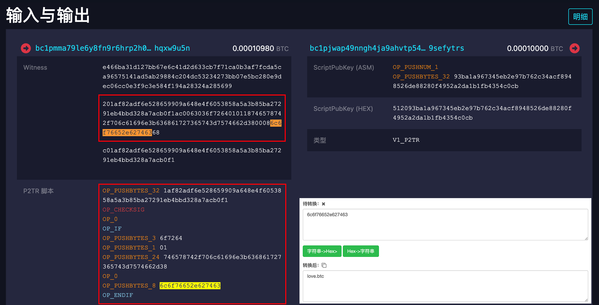
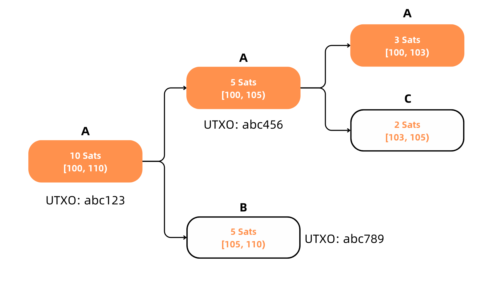

这是 #比特币生态 系列文章，旨在系统性的学习并建立较为完善的知识体系。

本文是第三篇，在经历 `SegWit` 与 `Taproot` 的两次升级后，序数协议(`Ordinals`) 有了诞生的土壤，铭文(`Inscription`)也随之而来，比特币生态的风渐起。

## **➤ Ordinals**

序数(Ordinals) 协议不是比特币的升级，而是以一种第三方(非比特币原生特性)的方式对比特币的最小单位`聪(Satoshi)`进行了`唯一化(排序)`，让每一个聪都有属于自己的 ID，至此聪成为了天然的可流动的索引。

以此还催生了`稀有聪`的玩法儿，把聪分了 6 个等级，分别为：

1. 神话 Mythic，创世块的第一个聪。

2. 传奇 Legendary，每个循环周期的第一个聪，每六次减半就会发生一些神奇的事情，减半和难度调整会同时发生，这就是所谓的相合，相合之间的时间周期是一个周期。大约每 24 年就会发生一次相合，第一次相合应该会发生在 2032 年的某个时候。

3. 史诗 Epic，每个次减半后的第一个聪，每 21 万个区块(大约每四年)，每个区块产生的新聪的数量就会减半。

4. 罕见 Rare，每个难度调整期的第一个聪，每 2016 个区块(大约每两周)，比特币网络通过调整区块必须满足的难度目标来响应哈希率的变化。

5. 非普通 Uncommon，每个区块的第一个聪。

6. 普通级 Common，非前面 5 类的聪。

只不过，对稀有聪的炒作情绪并不高或者说共识不够。

## **➤ Inscription**

而 铭文(Inscription) 是 Ordinals 协议、SegWit 升级和 Taproot 升级组合诞生的产物。

在比特币交易时，通过 P2TR(Pay-to-Taproot) 脚本在见证数据中写入数据(文本、图片、音频)，链上就会有一笔 UTXO 和见证数据绑定的记录，而聪也是存在于 UTXO 中，这样便实现了 **"UTXO - 聪 — 数据"** 这三者的绑定关系。一绑定关系的实现就是 Inscription 的诞生，这一过程称为`铭刻`！

那么创造实现了，怎么实现转账呢？就像我的比喻一样，UTXO 是一张任意金额(聪/比特币)的纸币，在铭文中它是作为聪的载体，在当被使用掉后，记录在 UTXO 上的聪就转移到另一个新的 UTXO 上了。

理解了这个，其实就明白了**流动的其实是聪这个唯一索引**，其他数据都在链上并不随着聪一起流动。

铭文利用比特币区块链来记录 "UTXO - 聪 — 数据" 的关系，并通过第三方编号的方式让聪唯一化，从而 "实现" 铭文的流动。但铭文需要一个依赖于比特币区块链的专属工具，来追踪比特币账户里的聪和对应铭文。如果没有这个工具，仅靠比特币的特性是实现不了的铭文的。

也因为聪唯一化的原因，铭文属于非同质化代币(NFT，唯一的并且不可分割的代币)。虽然方案不完美，但至少比特币上可以发行资产了。

---

无疑，铭文是比特币生态的起点，虽然没有引起全民铭文热，但已经为比特币上发行资产撕开了一个巨大的豁口，接下来该登场的就是 `BRC-20` 了！

大家如果觉得内容还不错，不妨给 [@BitHappyX](https://x.com/intent/follow?screen_name=BitHappyX) 点个关注？
