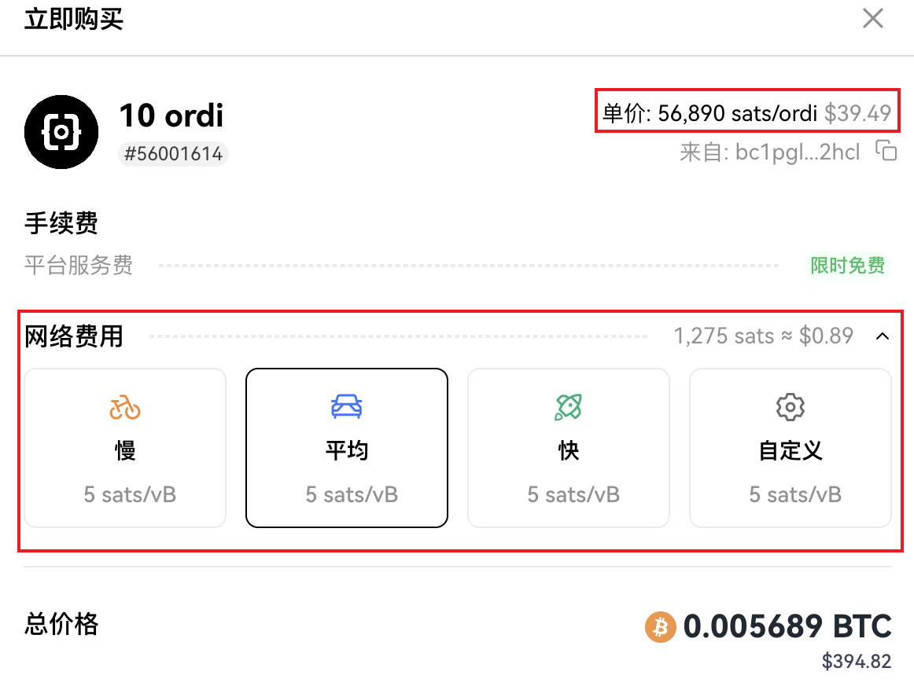
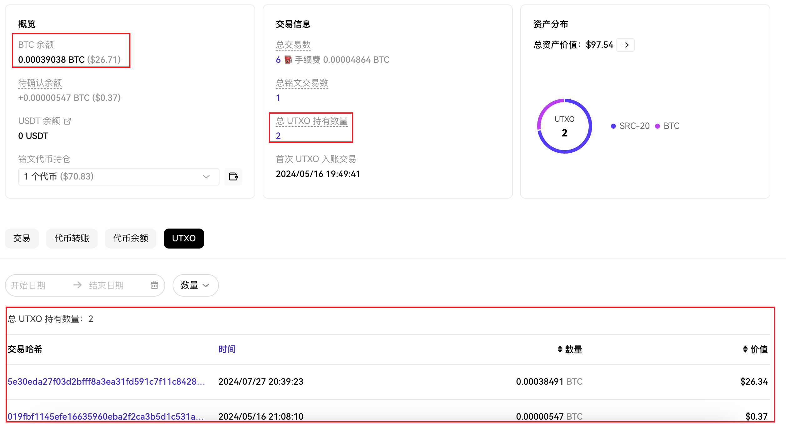

这是 #比特币生态 系列文章，旨在系统性的学习并建立较为完善的知识体系。

本文是第一篇，重点介绍 `Satoshi` 和 `UTXO`，这是开始了解比特币生态的重要基础知识。

## **➤ Satoshi**

Satoshi 中文为聪，是以中本聪命名的加密原语，是比特币的最小单位，每一枚比特币都是由一亿个聪构成的。聪在以前不太为人所知，大家的计量单位总是比特币，哪怕是 0.00000001 BTC，而聪的流行化是因为 Ordinals，而随着比特币价格的上涨，未来聪被提及的次数会更多。

## **➤ UTXO**

是 Unspent Transaction Output 的缩写，全称 "未花费的交易输出"，仅靠翻译有点难以理解，我换一个较为通俗的比方：**"一张任意金额的纸币"**。

在比特币的系统中一个比特币账户对应着很多张 "任意金额的纸币" 而这个纸币的货币单位是聪/比特币，账户的总金额就是多张 "任意金额的纸币" 上金额的总和。

在一笔比特币交易里，我们需要去花费比特币，就需要使用一张或者多张 "任意金额的纸币"，因为有时候一张纸币的额度不够，需要多张来凑，当我们把纸币付出以后，这张纸币就会被标记为已经消费，支付出去的和找零的会生成新的纸币。

 支付 3BTC，找零 0.299BTC 和 0.001BTC 的矿工费。来自 Spectrum Lab")

在比特币链上，每一个区块都是由一笔笔交易构成的，而 UTXO 则是每一笔交易的输入和输出。在每一笔交易中，除了 UTXO 还需要记录更多的信息，比如交易时间，签名信息等等。而在下一篇要介绍的两次比特币升级将对交易中信息的存储方式进行优化，也为比特币生态的爆发做了技术上的铺垫。

---

UTXO 是比特币生态是理解比特币的最重要的基础模型之一，而聪则是 Ordinals 与 BRC-20 的核心。

大家如果觉得内容还不错，不妨给 [@BitHappyX](https://x.com/intent/follow?screen_name=BitHappyX) 点个关注？
