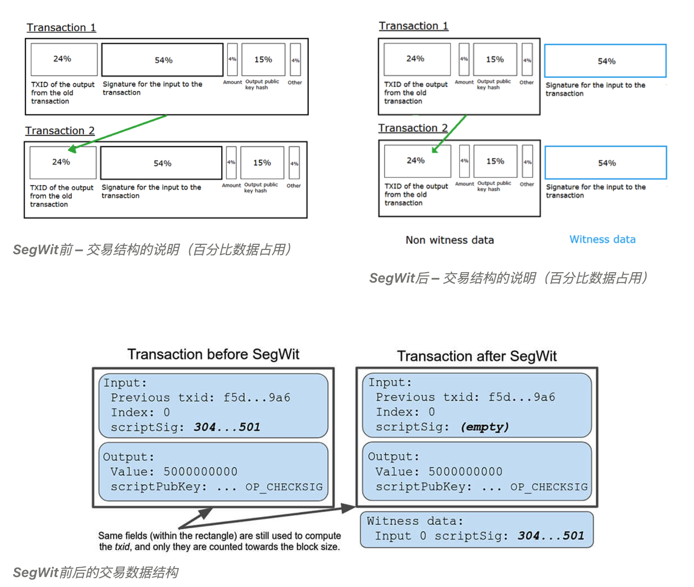
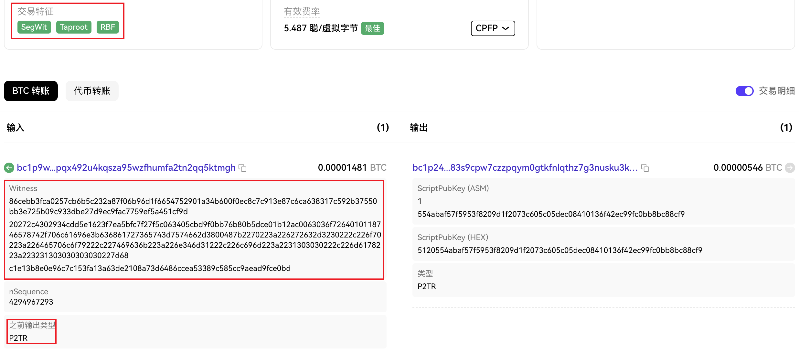
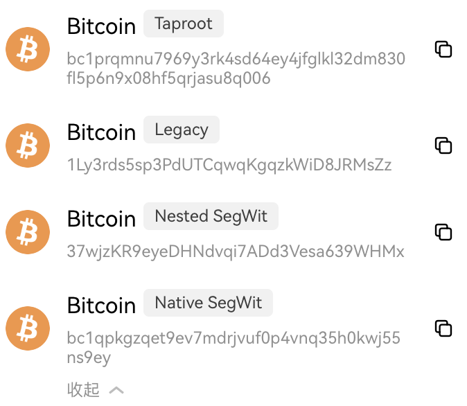

这是 #比特币生态 系列文章，旨在系统性的学习并建立较为完善的知识体系。

本文是第二篇，比特币生态是技术引发的叙事，`SegWit` 与 `Taproot` 升级是比特币生态的基石，没有这两次升级就没有 `Ordinals` 与 `Inscription`。

## **➤ 比特币升级：SegWit**

比特币在设计时，已经规定了一个区块占用 1M 的空间，而这个大小限制了每个区块容纳的交易量。

由于某些历史或文化的原因，修改区块大小无法实施，开发者便从交易着手。在 2017 年，比特币进行了一次名为隔离见证(Segregated Witness)的升级。

根据每一笔交易数据中的结构，将数据分为两部分：一为基础交易数据，包括输入和输出信息，输入信息指向要花费的 UTXO，输出信息指定接收者地址和新生成的 UTXO；二为见证/签名数据，用于验证交易的合法性，每个输入需要一个签名来证明发送方有权花费这些比特币。

将见证数据从交易的数据中剥离出来，用一个标记指向单独的见证数据，从而达到减少交易数据的占用的空间，见证数据的单独存储空间最大为 3M ，这也是常说的有效空间从 1M 变成了 4M。这样一来即减少了每一笔交易占用区块的数据量降低了矿工费(大概 35% 左右)，还优化比特币链的速度。

见证数据分离后给比特币增加了很多灵活性，其实已经初步具备铭文诞生条件了，但这时候才 2017 年，技术还需要进一步的迭代。

## **➤ 比特币升级：Taproot**

在 2021 年 11 月的 Taproot 升级后，比特币的见证数据可以包含更复杂的脚本，虽然还达不到以太坊智能合约的复杂程度。此外，Taproot 优化了区块空间的使用，使得见证数据可以更好地利用未使用的交易存储空间，接近 4MB 的上限。

Taproot 升级还引入了一种新的交易方式，叫做 P2TR(Pay to Taproot)。这种方式通过使用单个公钥或更复杂的脚本(比如多重签名钱包或智能合约)，实现了更高的隐私性和灵活性。P2TR 交易利用了 Merkle 化抽象语法树(MAST)和 Schnorr 签名技术，使得多个支出条件可以高效地编码在单个交易中。

通过 P2TR 交易，你可以使用密钥路径或脚本路径来花费比特币，这使得所有 P2TR 输出看起来都一样，从而提高了隐私性。

这也是为什么当提到比特币地址通常会要 bc1p 或 bc1q 开头的原因。

---

至此，比特币生态的基础技术土壤已然出现，但依旧需要等 1 年多比特币生态的起点 Ordinals 才诞生！

大家如果觉得内容还不错，不妨给 [@BitHappyX](https://x.com/intent/follow?screen_name=BitHappyX) 点个关注？
