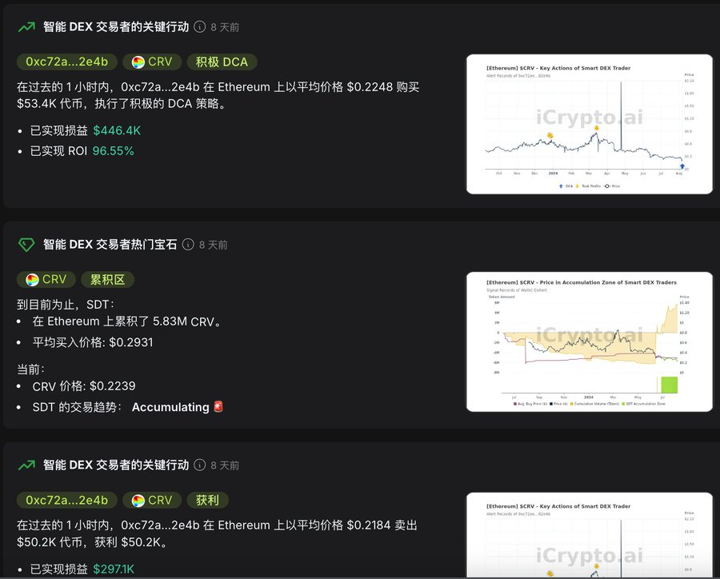
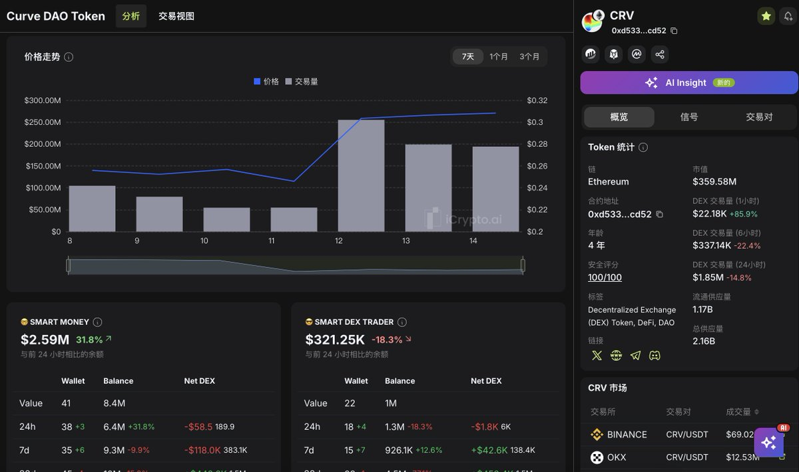
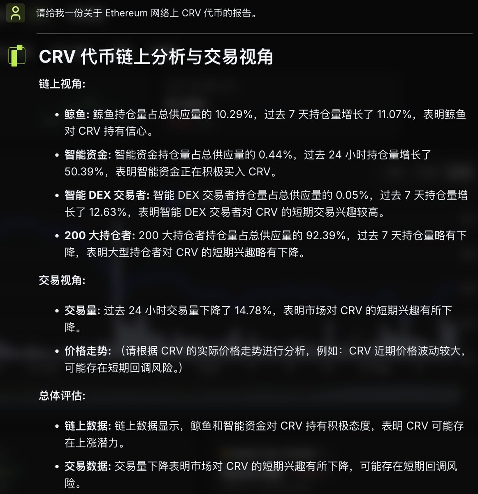

我对 $CRV 的关注度一直比较高，长期置顶的推文就是对 CRV 的整体回顾和重要性分析。

这次分享一个这几天在用的链上数据分析工具和对 CRV 的实操，效果还不错。

## **➤ 信号流(Signals Feed)**

这里主要有两个指标，一个是聪明钱的热门交易，比如某个代币交易量大或持续流入；另一个则是聪明钱的关键指标，比如某个钱包持续或者大额的买入。

图中，分别是最近几天 CRV 的持续买入，对应的就是币价这几天差不多上涨 30%，另一个则是某个钱包一小时内购买了 $53.4K 的代币。

## **➤ 代币详情(Analysis)**

搜索目标代币，查看代币详情和信息一览，基础的代币市值、流通量、总量都有，下方还有聪明钱和聪明交易者巨鲸的信息。

## **➤ AI 分析(AI Insight)**

直接用它们的 AI 生成初步的链上报告，可看图。

## **➤ 电报机器人(Telegram Bot)**

更牛逼的就是它的电报机器人了，功能非常的齐全，可以监听的事件也足够齐全。

我 TG 被封了，还没申诉回来，没办法给大家截图，文字版简单介绍一下功能吧：

1. 监控钱包的行为，比如代币的转入转出交易等。
2. 监听在推特上突然被频繁提及的代币。
3. 分析钱包，比如某钱包的盈亏，分析钱包的资产判断这个钱包的拥有者未来可能的操作。
4. 分析代币，安全，交易量，推特热度还可以给出相关的热门推文链接去看别人的分析。
5. 市场分析，直接给出当前市场上热门的代币，热门分为 CMC 的访问量，推特热门，热门的交易对。

## **➤ 我是如何使用的：**

我对 CRV 的操作是直接加入了关注列表的，没有通过它来进行代币的选择，所以具体使用就按照一二三步走，机器人的话几乎是必备的。

而对于普适性的操作，我建议先看信息流，查看聪明钱在持续的买什么，均价多少。如果当前价格低于均价，那么就加入观察列表或建一个底仓。然后进行自己的研究，配合其他工具比如 DeFiLlama、Dune 等工具分析一下。

好了，先就这些，大家觉得还不错的话，不妨给 [@BitHappyX](https://x.com/intent/follow?screen_name=BitHappyX) 点个关注，见证成长，一起暴富！
