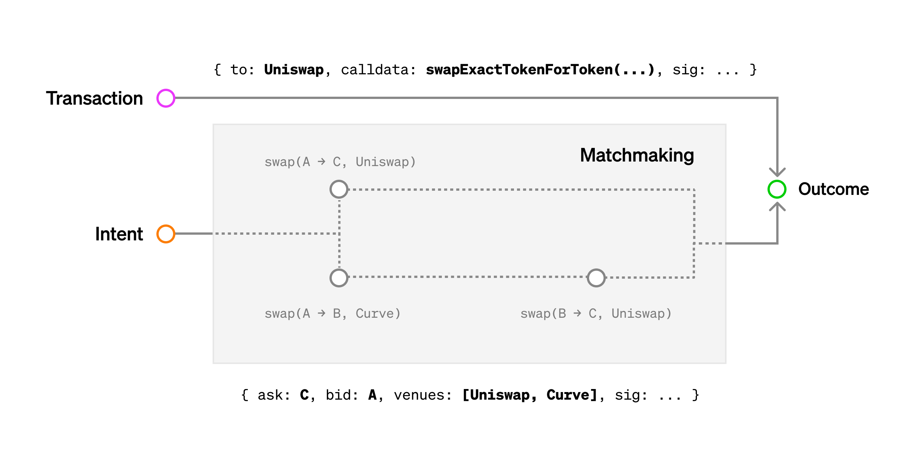
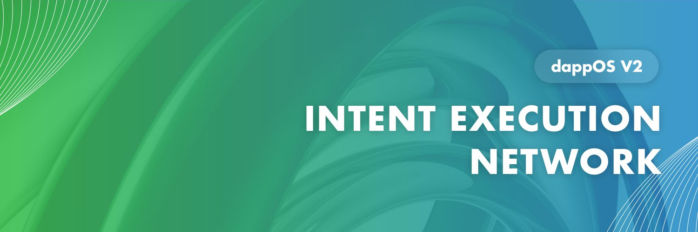
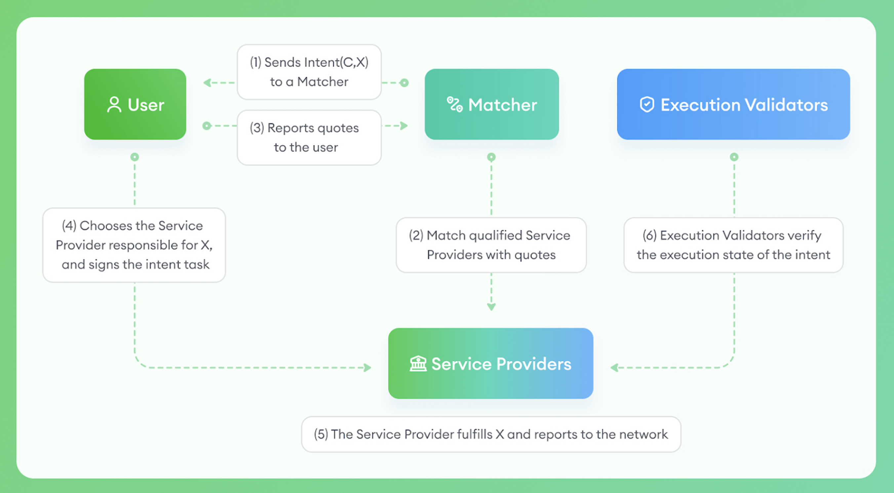
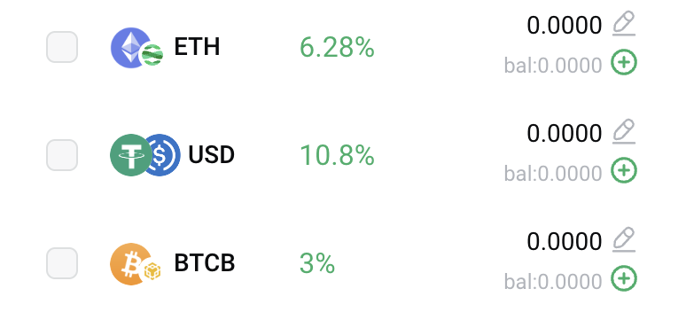

>意图想要解决的问题是简化用户操作和优化用户体验，这也是 Web3 目前亟需解决的问题之一，而拥有顶级投资阵容和精准卡位的 dAppOS 是毫无疑问的龙头。

关于意图为什么诞生，我在之前的币安 Space 中提过，这里有一篇文字贴，大家感兴趣可以看看。

链接：[https://x.com/BitHappyX/status/1830061747920912796](https://x.com/BitHappyX/status/1830061747920912796)

**对意图已经有一定了解的朋友，可以直接下滑至 dAppOS 的篇幅！**

## **➤ 意图的工作流程：**

意图的工作流程：用户选择目的 -> 匹配并执行解决方案 -> 获得结果

较为常见的例子便是跨链交易，虽然目前跨链在用户侧的表现形式几乎大同小异，即选择 A 链的资产和 B 链的资产，最后点击确认。

但大家都知道跨链的协议特别多，每个跨链协议支持的币种、手续费和速度都是不同的，那么我们其实最想要的可能是速度最快或者手续费最低的跨链协议。

而跨链版本的意图是综合多个跨链协议的，会通过多角度筛选出综合最优的协议供用户选择。

## **➤ 意图的分类：**

**通常来说，意图也分为两类，通用意图和专用意图。**

专用意图目前较为常见，即解决专一问题的意图，比如 1inch Fusion 和 UniswapX 推出 兑换(Swap) 意图，还有 Orbs 推出的 现价单(Limit Order) 意图等等。

而通用意图的用例则更为广泛所需要做的基础建设也更多，比如专用意图中一些只做交易的，无法执行跨链操作，而做跨链的意图无法执行交易(也有一些可以)。也即是说，通用意图可以将零散的专用意图排列组合为一种新的意图，更好的为用户的目的服务。但通用意图不仅于此，因为只要涉及到通用，必然会涉及到建立标准，随之而来就是为了管理标准搭建自己的平台。

也即是说，专用意图是某些项目或协议的衍生功能，而通用意图更多的是一种基础设施和平台。

## **➤ 意图的未来：**

做大行业的第一步是获取新用户，第二部是留住新用户。而降低用户的门槛是留住新用户的必要手段，也是行业在发展过程中不可阻挡的趋势。

意图在诞生之初，并没有过于死板的技术规划，其主旨很清晰，就是为用户的目的服务。

也就是说，意图能包含的东西很多，比如账户抽象在做的无 Gas 交易，智能账户；链抽象在做的抽象和统一各个区块链的技术细节，给用户提供一个简单的多交互链上方式；等等都是可以包含在链抽象的技术细节内的。

甚至于说，为了用户的目的能够达到，甚至会使用中心化的方式，提供给用户最好的结果。

## **➤ dAppOS 的意图是什么：**

dAppOS 属于通用意图，是平台和基础设施。

根据目前的产品形态和白皮书可以看出，其更想把自己打造为一个平台。

在其规划中分为三个部分，意图资产的资管平台、集成意图的 dApp 中心和链上意图交易，总体表现形式很像 Web3 钱包。

成为平台当然是最顶层的设计，dAppOS 官方的定位为 "基础设施" 虽然有些谦逊，但确实是基本盘。

## **➤ dAppOS 机制的核心：**

dAppOS 最特殊的点，也是最具备优势的点，就在于`乐观最小化质押(Optimistic Minimum Staking)`的安全设计。

大家如果熟悉 PoS 或者借贷，会比较好理解，简单而言就是惩罚机制，成为执行意图操作的解决方案提供商，需要质押可操作价值的 3 倍资产，用于保障用户的操作顺利和安全，如果结果不顺利，用户即可获得当次操作价值的赔偿。

**听起来很简单，但是这个设计暗合意图的基本原则，即为目标/结果服务。**

也因此，大家可以放心大胆的使用 dAppOS 的意图，最终给予用户的结果只有成功或者赔偿。某些情况下甚至会期待它失败，毕竟不是每一笔投资和操作都是翻倍的回报。

## **➤ dAppOS 产品的核心：**

产品核心有两个，一个是`意图执行网络`，一个是`意图资产`。

**意图执行网络是 dAppOS 为用户隐藏一切细节的关键，用户只需要选择自己的目标，背后的一切都将交它。**

而其中的核心，除了保证安全的 Optimistic Minimum Staking 的机制；另一个则是对**解决方案提供商的筛选**，比如用户交易可以摆脱 LP 和挂单的方式，直接选择做市商甚至 OTC 的方式，也就是说 dAppOS 的意图解决方案**不局限于链上，也可能有在链下**，普通用户和小资金量也有可能接触到顶级的机构和享受更优质的服务。

**意图资产，则是活期存款的加强版，因为它在生息的同时可以进行原生资产的操作。**

比如可以把支持的链上 $ETH $USDT $USDC $BTC 存到 dAppOS 中，转换为意图资产实现生息。当想要进行交易时可直接使用，比如在支持意图的 KiliEX、GMX 进行交易等等。

## **➤ dAppOS 的未来：**

正如我之前的观点，**意图**极有可能是此轮牛市解决 Web3 高门槛的最终解决方案。

而 dAppOS 通过乐观最小化质押(Optimistic Minimum Staking)的安全方案，让意图更好的为用户目的服务，而不用担心资产安全，是一个极大的创新。

即使 dAppOS 无法成为一个流行的平台，但作为一个基础设施被整合到各大顶级的产品中，也能在**降低用户门槛的市场**份额上占据一大块蛋糕！

如果大家觉得还不错的话，不妨给 [@BitHappyX](https://x.com/intent/follow?screen_name=BitHappyX) 点个关注，见证成长，一起暴富！
