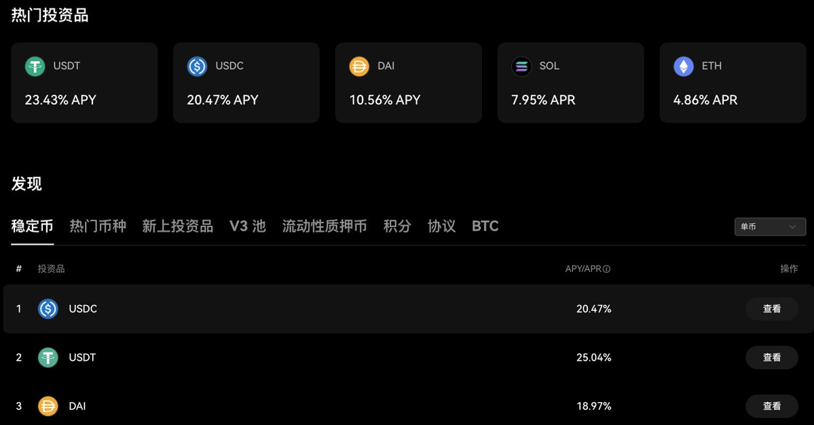

>如果你想在实战中了解链上世界，那么 OKX Web3 钱包是目前最好的选择！

无论是基础的链上资产管理，还是链上协议交互，亦或是参与 DeFi 生息，甚至全面参与某个生态，它都能为你提供一个完美的环境。

只需一套「助记词」即可管理近乎所有链的资产！

## 多链钱包

比特币、以太坊、以太坊兼容链（如 BSC、ARB、OP）、SOL、TON、SUI 等热门和冷门链都已被 OKX 接入。

这不仅省去了记忆多套助记词的烦恼，也方便了资产管理。你还可以通过 OKX Web3 钱包直接进行加密货币的交易和跨链操作。
OKX 钱包在多链资产管理方面表现出色，其次是 DeFi 生息。

## DeFi

在这里，你可以寻找高收益的挖矿机会。

钱包会根据你持有的资产进行推荐，当然你也可以手动搜索某个加密货币的生息情况。

找到生息资产和协议只是第一步，OKX 钱包还提供了安全信息介绍，一些新协议甚至会有评分。你可以直接在 OKX 钱包界面进行协议交互，无需额外跳转 DApp。

此外，OKX 经常与热门生态或协议合作推出「加息活动」，在原有利息基础上额外增加 6% - 10% 的利息(代币激励的形式)，通常是 $USDT 和 $USDC 这类稳定币的活动。

通过这些加息活动，吸引用户参与完整的 DeFi 玩法，并指引用户完成基本的链上交互。当你需要寻找链上协议时，OKX 也提供了一个方便的入口。

## DApp 中心

你是否也为寻找某个协议或类型的协议而烦恼？OKX 钱包提供了一个完备的 DApp/协议中心，并根据不同链和类型进行分类。

例如，当我不知道用什么协议进行跨链操作时，只需打开 OKX，选择类型和链，就能找到答案。

除了常见的 DeFi 协议和用户主动寻找的链上协议交互，OKX 还提供了两套带有福利的全方位生态玩法。

## Cryptopedia

与项目联合推出的「Cryptopedia」是新人进阶的最佳方式。它不仅提供一系列指定协议交互，还常常有福利大放送。

通过完成每一期的 Cryptopedia，你将学习到许多复杂的组合操作，如交易、跨链、DeFi、Mint NFT 甚至是打铭文/符文。完成这些交互后，你还可以获得奖池中的奖励，甚至潜在的空投机会。

Cryptopedia 更注重福利，常用于推广项目生态，而另一种则是带领用户全方位体验热门生态。

## Eco Hub

加密货币领域热点时常更迭，近半年就从 SOL 生态到 TON 生态再到 SUI 生态。这些生态热门时，其代币会率先上涨，带动大家对生态的关注。

生态内的项目很多都是大家不熟悉的，生态门户可以作为学习工具，涵盖该生态必备和热门项目，并给出某些项目是否在举行活动或有空投预期。

即使不进行交互，仅作为信息筛选，也能发现不少潜在机会。

## 什么？你还没有 OKX 账户？

使用此链接注册并下载 OKX，开始你的链上之旅吧！

👉 链接：[https://www.okx.com/zh-hans/join/86675189](https://www.okx.com/zh-hans/join/86675189)

OKX Web 钱包不仅仅可以作为链上世界的入口，作为引导和学习 Web3 的工具也是十分称职的！

---

如果你也有朋友想要进入 Web3，就推荐他使用 OKX Web3 钱包吧，你也可以把本文转发给你的朋友！

如果大家觉得内容还不错，不妨给 [@BitHappyX](https://x.com/intent/follow?screen_name=BitHappyX) 点个关注，见证成长，一起暴富！
