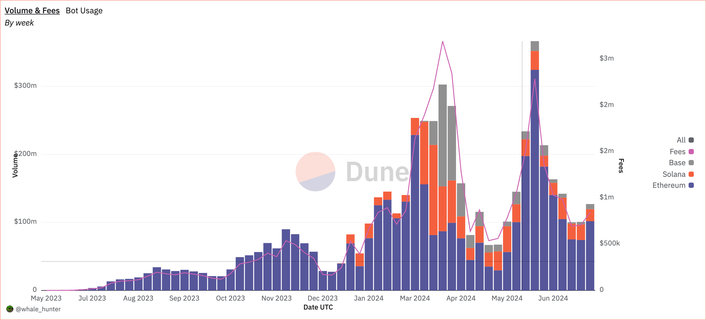

**Banana Gun 起初是利用 Telegram 机器人功能，为用户简化链上操作和高效精准进行链上交易的服务，现在已经开启了网页的测试版。**

代币信息：$BANANA 现总量 8,900,000，3,220,000 占总量的 36%，已燃烧 11%

融资：2023-09-08 融资 120W 美元。

本文概要：它的故事，它做了啥，盈利状况，代币经济学解析。

## **➤ 香蕉枪的故事！**

23 年上半年，市场还处于熊市，铭文还没露头。交易机器人的出现让土狗在熊市火热了一段时间，那是 Telegram 第一次向大众展示自己潜力(至少是我第一次感受到)。

那时 TON 生态还处于迷雾中，大家对 Telegram 普遍的看法是一个 Web3 用户常用的社交软件，在上面做一些应用还是可以方便用户的，比如各种群管理、代币监控、红包、小小游戏等等机器人。不同于现在大家耳熟能详的 TON 生态和 Telegram 小程序，交易机器人的火爆在熊市燃起了一把牛市的火。

但，在熊的趋势下，不够宏大的叙事没办法持久，直到到 23 年年末铭文的出现才标志着这轮熊市的结束。

## **➤ 它做了什么？**

最重要的就是抢开盘，经常链上拼杀的大家都知道，一个新盘子开盘的一瞬间一般都是暴涨的，而你能以最快的速度(合适的价格)买入并卖出的，这收益是非常可观的。

在没有这类的狙击机器人的时候，这个是有技术门槛的，现在我们拥有了低门槛的狙击机器人并通过配置自动化，能高频率的抢开盘，这收益非常诱人的。

而其他的功能，更多的是链上交易的扩展，比如防夹子，防 Rug，限价单等。

## **➤ 盈利状况**

我的老粉都知道，我很关心项目的盈利的状态，毕竟每个项目都需要养活团队，关于判断项目是否盈利可以看我这篇入门级别的推文：

👉 ：<https://x.com/BitHappyX/status/1805156352052150613>

根据 Dune 上的面板数据可知，最近 3 周每周 Fees 收入在 70W 美元以上，而在 6 月的第一周收入为 220W 美元。

按照图表的走势和大行情基本一致，也就是说行情好 Fees 的收入越高！

## **➤ 代币经济学解析**

详细并较为全面的代币经济学解析可看我这篇文章 👇



代币数量的基本情况已经在文章开头列出，从中可以得出部分结论，流动量占比还不错，以前上的代币一般流动量在 10% 左右，而它有 36%，而且代币已在市场上流通较久，不太需要担心砸盘的情况。

关于空投部分，这是 #Binance HODLer 第一期的项目，会有 800,000 代币(总量的 9%)用户给长期持有 $BNB 的用户作为福利。

在代币赋能上，设计上有内外两层循环，内循环则是持有/燃烧代币开放更多功能和治理投票，外循环则是持有代币可获得交易机器人的收益分发。虽然是很常规的设计，但是考虑到它的收入跟着大行情走，分配的收入是值得期待的！

## **➤ 其他信息**

另外，对于还未注册币安的朋友，可以使用哈皮的返佣链接注册，以节省 20% 的交易手续费。不要小看这些手续费，币安的现货交易手续费是 0.1%，1000 元的买卖交易会产生 2 元的手续费！

👉 链接：<https://binance.com/zh-CN/join?ref=VA0OUR3W>

👉 邀请码：VA0OUR3W

点击下方链接，查看教程 👇


## **➤ 结尾**

Banana Gun 在时隔一年多后再被币安翻出来上线，也已经证明了他的潜力，也提醒了大家不要忽略行业中的价值标的！

关于币安的 HODLer，借用吴老师 @BTW0205 的话：

> HODLer 空投是回溯逻辑，而 Launchpool 是买入逻辑，Megadrop 则是持有和任务逻辑；**简单来说，一个是对过去的奖励，一个是对未来的奖赏！**

如果觉得内容还不错，不妨点个关注 [@BitHappyX](https://x.com/intent/follow?screen_name=BitHappyX)，顺便一键三连，下一篇再见！👋
