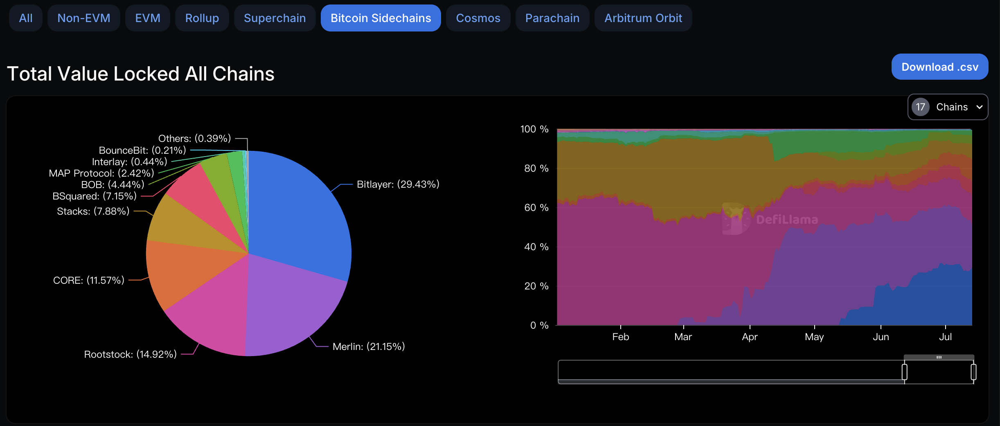
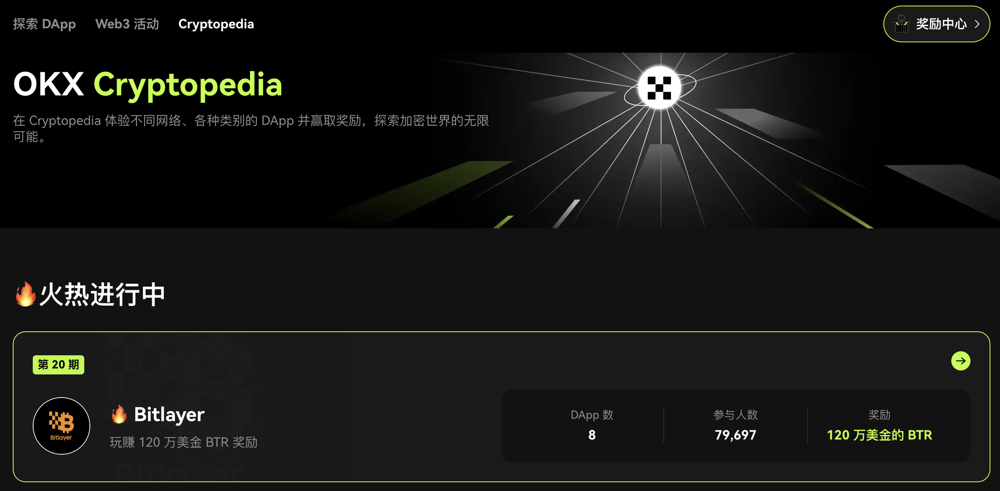
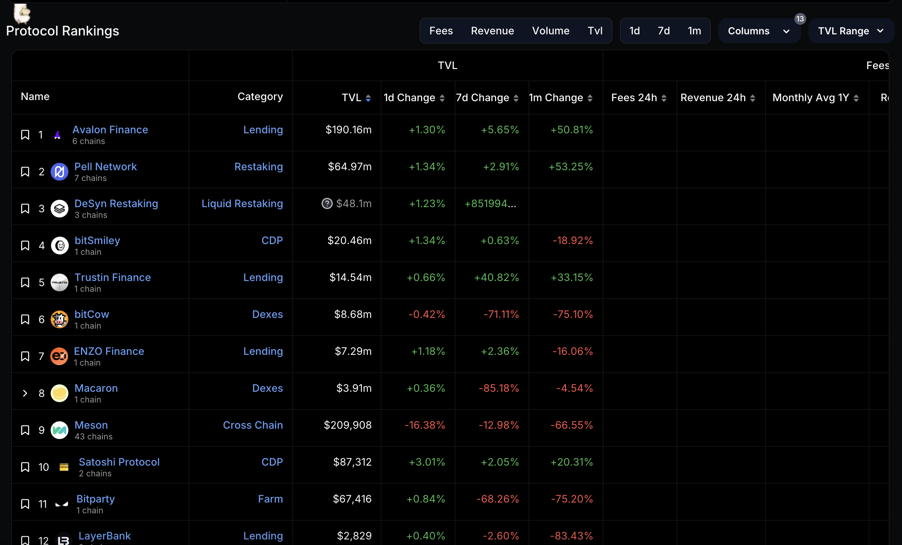

--- 
title: Bitlayer 的 TVL 何以成为 BTC L2 的 No.1 ？
description: Bitlayer 的打法和 Arbitrum 如出一辙，名为建立生态！众所周知 Arbitrum 是所有 L2 中生态做的最好的。核心俩大件：第一，激励开发者；第二，给用户发福利。
date: 2024-07-13 02:33:33 +0800
keywords: ["BitHappy", "Web3", "思维", "Web3 思维", "思考", "Web3 思考", "深度", "Web3 深度", "资料", "Web3 资料", "知识库", "Web3 知识库", "Bitlayer", "OKX", "BTC", "BTC L2", "Arbitrum", "生态", "TVL", "比特币生态", "空投"]
tags: ["哈皮杂谈", "BTC Layer2"]
---

现在谈起比特币生态，大家马上想到的可能只有 $Pizza 了，但它终归是偏向 #MEME 的，而一个生态断然不能只有 MEME。

那就让我们看看在铭文爆火后的，另外一个叙事 BTC L2 发展的怎么样。

根据 DeFiLlama 的数据显示，在已上线正式网的比特币侧链(别问我为什么这样分类，逃)的分类中，Bitlayer 以 $309.8M 的 TVL 超过 Merlin 的 $222.57M 跃居第一。

从图表数据中的中能看到 Bitlayer 的 TVL 一直处于增长趋势，前两周有些降低，估计也受到了德国政府抛售 BTC 的影响。

## **➤ TVL 猛增的背后 Bitlayer 做了什么？**

经过一番信息检索，发现 Bitlayer 的打法和 Arbitrum 如出一辙，名为建立生态！众所周知 Arbitrum 是所有 L2 中生态做的最好的。

核心俩大件：第一，激励开发者；第二，给用户发福利。

在激励开发者方面：Read Player 第一期设立了 5000W 美元的奖励基金并给开发者提供流动性和社区建设的支持，我估计还有技术层面上的帮助。后又设置 200W 美元的生态项目上线交易所的基金，

在用户发福利上，开了交互 DApp 空投 2000W 的代币激励计划和和头矿节(提高挖矿收益)，最近又在 OKX 上举办 Cryptopedia 活动，奖池 120W 美元。

给用户送钱肯定会吸引到很多羊毛党，撸完就撤的情况肯定会出现，转化效果比较一般。而激励开发者并设立一定的门槛，对于扶持生态项目很不错，一来不至于空链，二来不至于用户没地方玩儿从而流失。

做链其实就是做平台，生态是吸引用户手段，无论是有众多的 DApp 还是持续不断的撒钱，这两种措施都是行之有效的，互相结合则更好。

## **➤ Bitlayer 生态的项目丰富吗？**

还是根据 DeFiLlama 目前能看到的协议中分析，能看到一共 13 个项目，其中 8 个为专属项目。而在 OKX 钱包上举办的活动 6 个 DApp 应该是属于比较重量级的生态项目了。这些项目里包含去中心化交易所、借贷、质押收益、游戏、稳定币，基础的生态应用已然构成。

而根据官方信息，在第一期的开发者激励上，吸引了 500 多项目报名，共计 100 多个项目已部署在 Bitlayer，其中包含一些多链项目和 Bitlayer 专属项目。

官网的项目实在过于多了，我看不过来，但是 Bitlayer 通过激励开发者和用户建立生态的方式，在 BTC L2 上是成功的，毕竟 TVL 趋势向好。

---
TVL 不能构成对一个项目唯一判断，但这是一个视角，我研究后觉得自己对 Bitlayer 关注的稍晚了一些，早点参与的话能吃到第一期的用户空投奖励。

大家如果觉得内容还不错，不妨给 [@BitHappyX](https://x.com/intent/follow?screen_name=BitHappyX) 点个关注？
