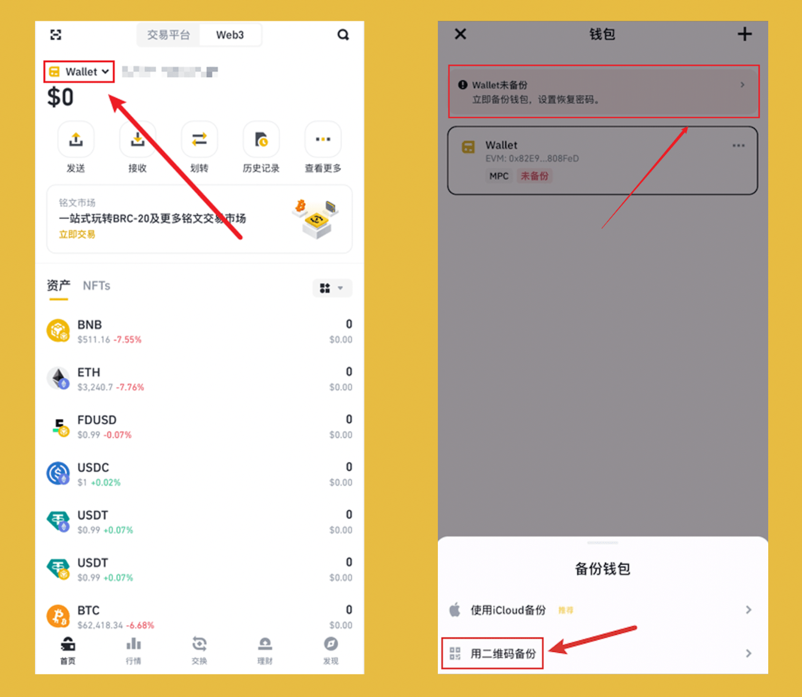
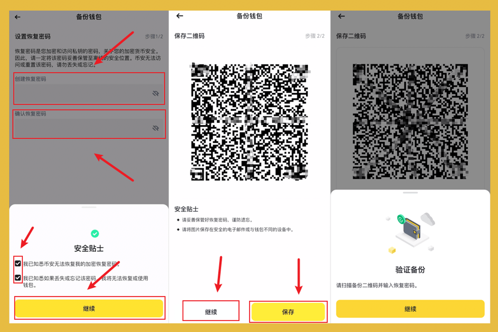

Web3 钱包才是加密世界的入口，也是币圈必备的工具之一！如果你想博大的机会，那么来吧，属于你的加密之旅才刚刚开始！

哈皮始终认为加密货币的高收益机会在一级市场(即链上)，只有链上的优质的项目才会上线币安等交易所，而在上线交易所之前，必然已经拥有几十甚至上百倍的涨幅！

Web3 钱包不同于传统互联网行业的账号系统，不是由账号+密码为基础组成的账户，也不会有互联网公司会存储你的钱包。也就是说，如果你换设备或想在新的设备使用原来的钱包，而没有备份，那么你的账号将无法找回或恢复！

本篇以宇宙第一大所 #币安 Web3 钱包为例，以图文线程的方式，用详细的教程，教大家如何创建 Web3 钱包！

## **0/ 前置：注册 + 充值 + 交易**

>未注册的可使用哈皮的返佣链接注册，节约 20% 的手续费，不要小看手续费，币安现货手续费是 0.1%，1000 块钱买入卖出，收 2 块钱手续费！

👉 注册链接：[https://www.binance.com/zh-CN/join?ref=VA0OUR3W](https://www.binance.com/zh-CN/join?ref=VA0OUR3W)

👉 教程链接：[注册 + 充值 + 交易](https://bithappy.xyz/posts/how-to-trade-on-binance/)

## **1/ 创建 Web3 钱包：**

打开 `App` -> 点击 `Web3` -> 点击 `创建钱包`

## **2/ 开始备份：**

必须备份，务必备份，一旦钱包遗失，没有备份便无法找回！！！

点击 `Wallet` -> 点击上方 `备份` -> 点击 `用二维码备份`

iOS 系统可以用 iClond 备份，在安卓是 Google 备份，这里统一推荐二维码备份，注意二维码不要上传云端，也不要与钱包同一个设备存储！

## **3/ 完成备份：**

设置恢复密码：输入 `恢复密码` -> 勾选 `两个须知` -> 点击 `继续`

备份钱包二维码：点击 `保存` -> 不要存储在云端，不要保存在同设备

验证密码与备份：点击 `继续` -> 扫描 `钱包二维码` -> 输入 `恢复密码`

## **4/ 自由探索：**

关注[@BitHappyX](https://x.com/intent/follow?screen_name=BitHappyX)，见证成长，一起暴富！

如果内容对你有帮助，还请一键三连，谢谢！！！
