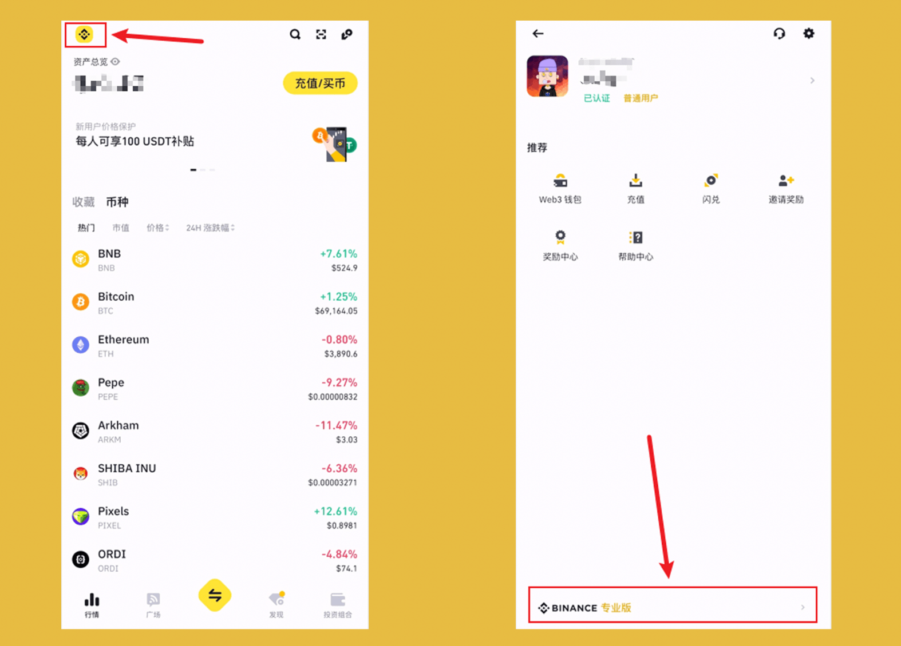
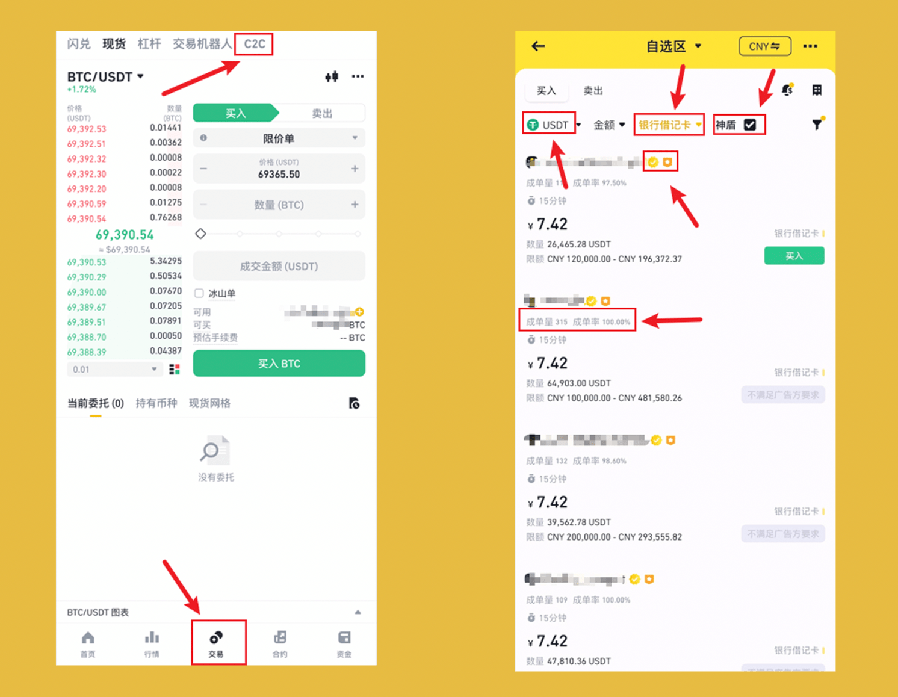
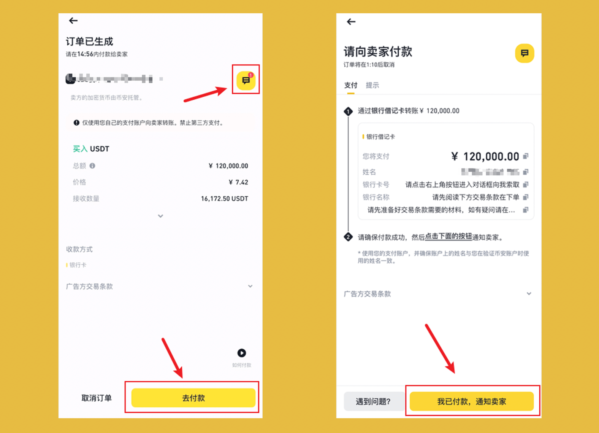

新人入币圈，注册完交易所账户后，第一个难点就是入金，何为入金？简单理解就是把钱从银行卡转到支付宝/微信的步骤，而我们要做的就是把钱从银行卡/支付宝/微信转到交易所 App。

在入金的过程中，会经过从法定货币到虚拟货币的步骤，当然也可以理解为用法定货币购买虚拟货币！

本篇以宇宙第一大所 #币安 为例，以图文线程的方式，用详细的教程，解决新人入门第一个难关！

## **0/ 前置：注册**

>未注册的可使用哈皮的返佣链接注册，节约 20% 的手续费，不要小看手续费，币安现货手续费是 0.1%，1000 块钱买入卖出，收 2 块钱手续费！

👉 注册链接：[https://www.binance.com/zh-CN/join?ref=VA0OUR3W](https://www.binance.com/zh-CN/join?ref=VA0OUR3W)

👉 教程链接：[注册币安](https://bithappy.xyz/posts/how-to-register-on-binance/)

## **1/ 切换至专业版：**

登录 App -> 点击左上角 `币安图标` -> 点击下方 `专业版`

## **2/ 最好的入金选项：**

• 卖家要成交率高的，标识多的，保证入金的安全与顺利

• 目标虚拟货币，只选择 USDT，其他有溢价

• 支付方式，优先银行卡，交易有风险，万一封了支付宝/微信得不偿失，银行卡可再办

App -> 点击下方 `交易` -> 点击上方 `C2C`

## **3/ 下单交易：**

• 按金额购买，避免简单的数学计算

• T+1 提现保护，意思是今天买，明天才能提现到一级市场，进行链上操作，不影响 App内交易

• 交易条款，一定要看，不满足条件是无法达成交易的

选择 `目标卖家` -> 输入 `金额` -> 点击 `买入 USDT`

## **4/ 开始交易：**

付款的步骤，一定要与卖家沟通好，确认符合卖家要求后再打款。打款后等待虚拟货币到账即可

点击右上角 `图标` -> 与卖家沟通获取 `收款方式` -> 点击 `去付款` ->  付款后点击 `我已付款，通知卖家` -> 等待卖家发货

至此交易完成。

## **5/ 自由探索：**

关注[@BitHappyX](https://x.com/intent/follow?screen_name=BitHappyX)，见证成长，一起暴富！

如果内容对你有帮助，还请一键三连，谢谢！！！
