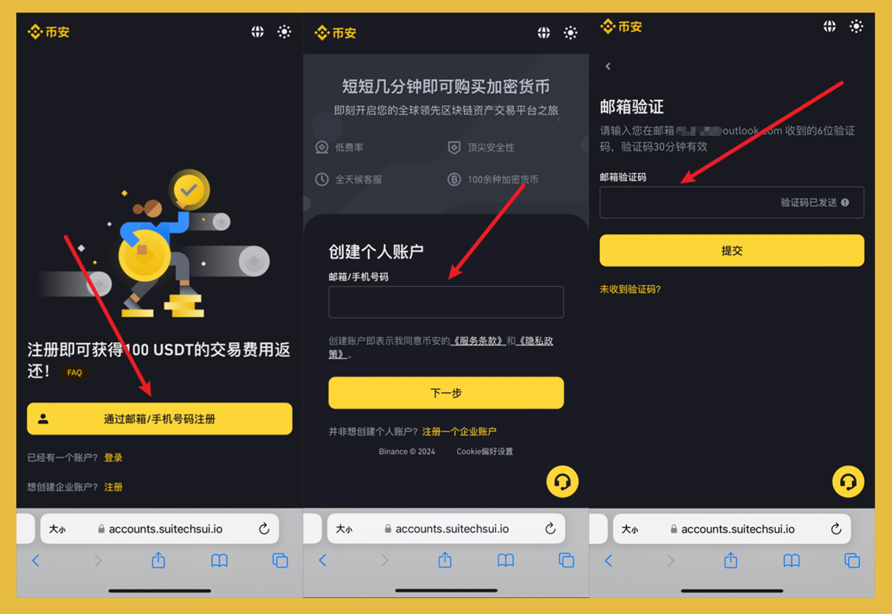
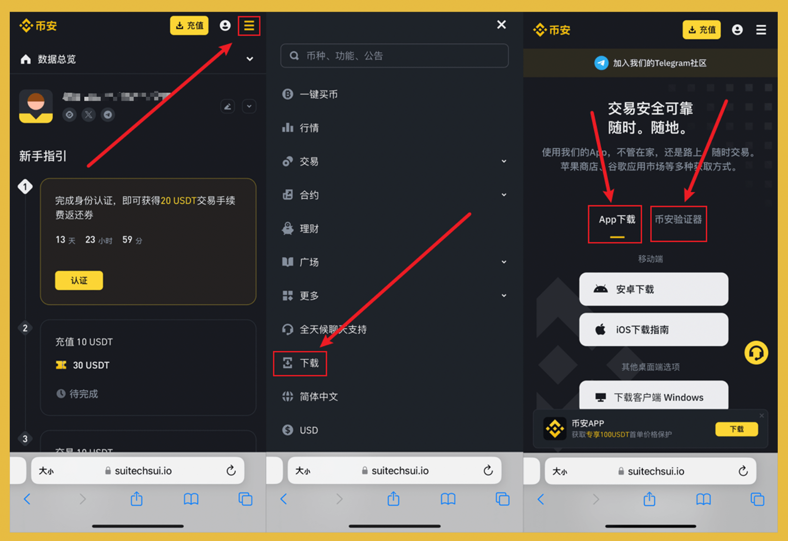
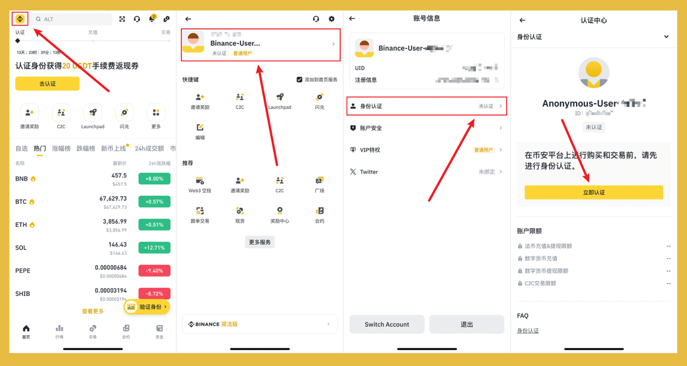
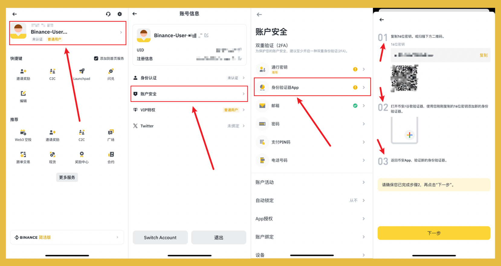

新人入币圈，必须要拥有的就是一个交易所账户，除非有朋友给你提供整套链上服务并且不玩二级市场！不过你也不愿意总是麻烦朋友吧？

注册交易所听起来挺简单的，不就是搜索网站或下载 App 吗？莫不知币圈骗局千千万，假冒网站和虚假 App 最泛滥！更何况还有省钱小妙招！

本篇以宇宙第一大所 #币安 为例，以图文线程的方式，用最详细的教程，解决新人注册问题！

## **1/ 省钱小技巧：**

> 强烈推荐使用返佣链接注册，以节约手续费，哈皮的返佣链接，可节约 20% 的手续费！
不要小看手续费，币安现货手续费是 0.1%，1000 块钱买入卖出，收 2 块钱手续费！

点击下方任意链接注册 👇

👉 主链接：[https://www.binance.com/zh-CN/join?ref=VA0OUR3W](https://www.binance.com/zh-CN/join?ref=VA0OUR3W)

👉 备链接：[https://www.suitechsui.club/zh-CN/join?ref=VA0OUR3W](https://www.suitechsui.club/zh-CN/join?ref=VA0OUR3W)

## **2/ 创建账户：**

注册方式选择邮箱，避免使用 +86 手机号，建议使用 gmail 或 outlook，防止国内邮箱出问题

邮箱注册 -> 输入 `验证码` -> 输入 `密码` -> 确认推荐码 `VA0OUR3W`

## **3/ 下载 App：**

使用返佣链接注册的另外一个好处就是避免下载到虚假 App

点击 `右上角三横杠` -> 点击 `下载` -> 下载 `App` 与 `币安验证器`

币安验证器用于保证安全，教程在下方

## **4/ 身份认证：**

此处不要担心信息泄露，务必使用真实的身份证，以免后续账号问题出现纠纷

打开 `币安 App` -> 使用邮箱登录(中途能跳过就跳过) -> 点击 `左上角币安标志` -> 点击 `头像栏` -> 点击 `身份认证` -> 点击 `立即认证`

## **5/ 增加安全验证：**

交易所账户安全与资金息息相关，务必开启二次验证，手机短信+邮箱+2FA

点击 `左上角币安标志` -> 点击 `头像栏` -> 点击 `账户安全` -> 点击 `身份验证器` -> 点击 `启用` -> 按照 App 内教程操作，绑定币安验证器 -> 输入 `身份验证器App验证码`

## **6/ 自由探索：**

关注[@BitHappyX](https://x.com/intent/follow?screen_name=BitHappyX)，见证成长，一起暴富！

如果内容对你有帮助，还请一键三连，谢谢！！！
