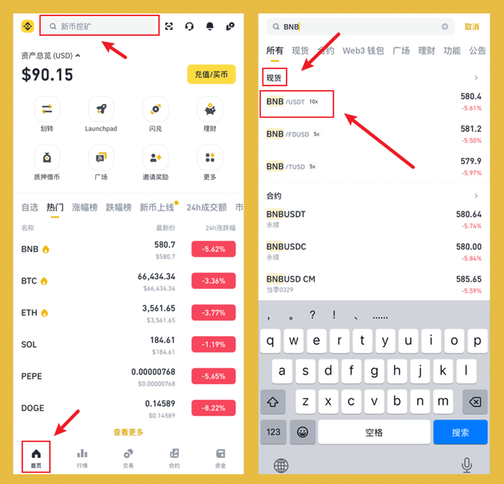
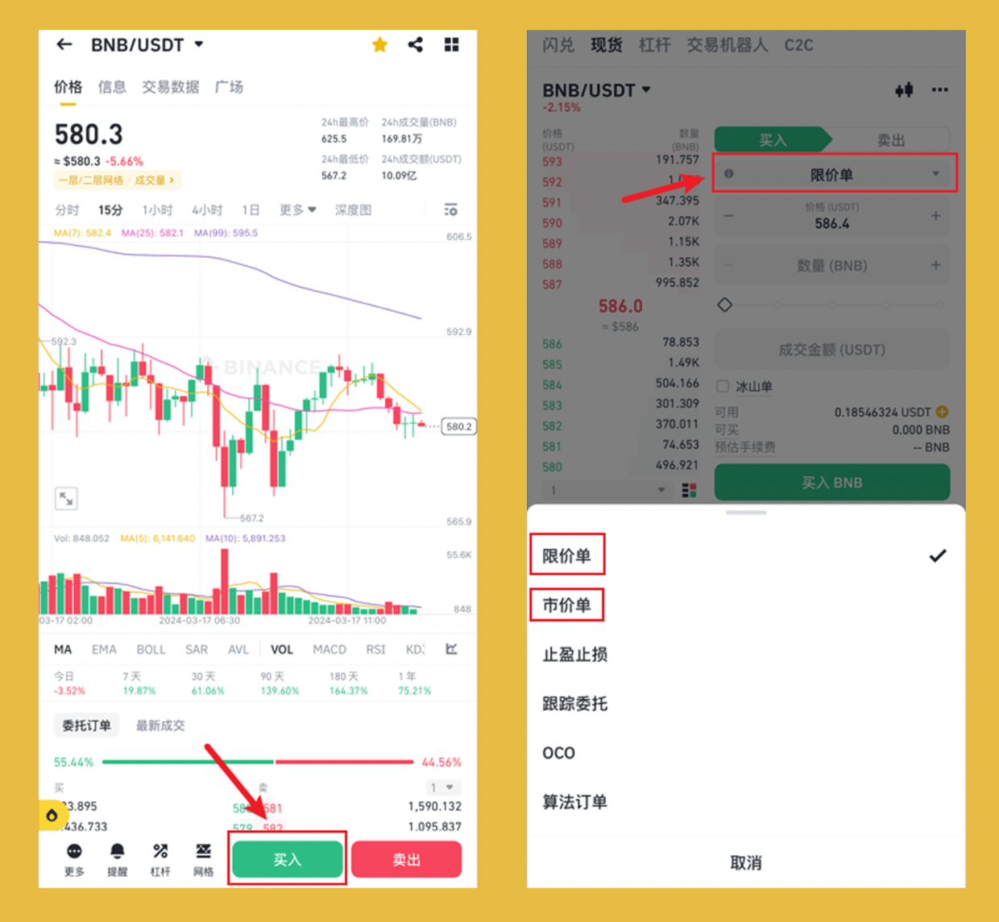
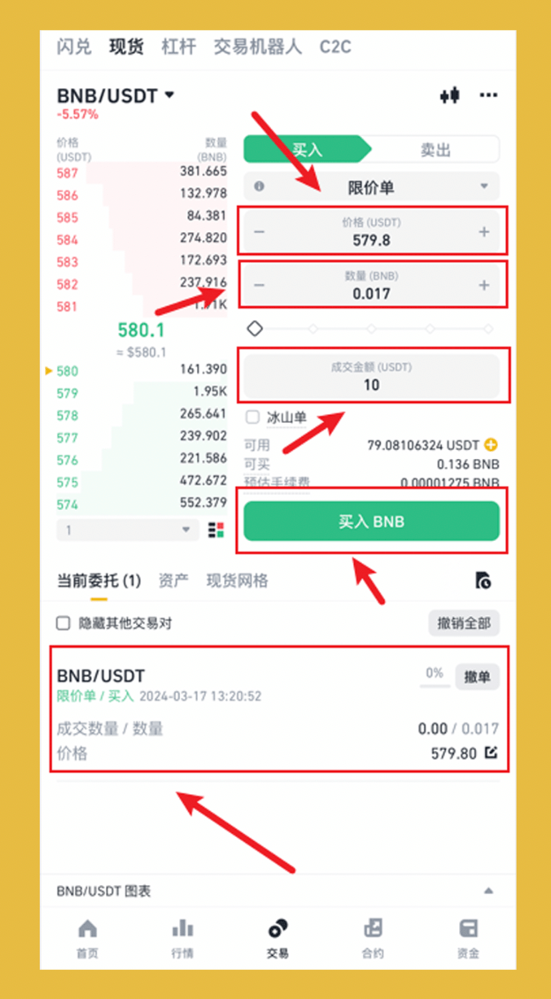
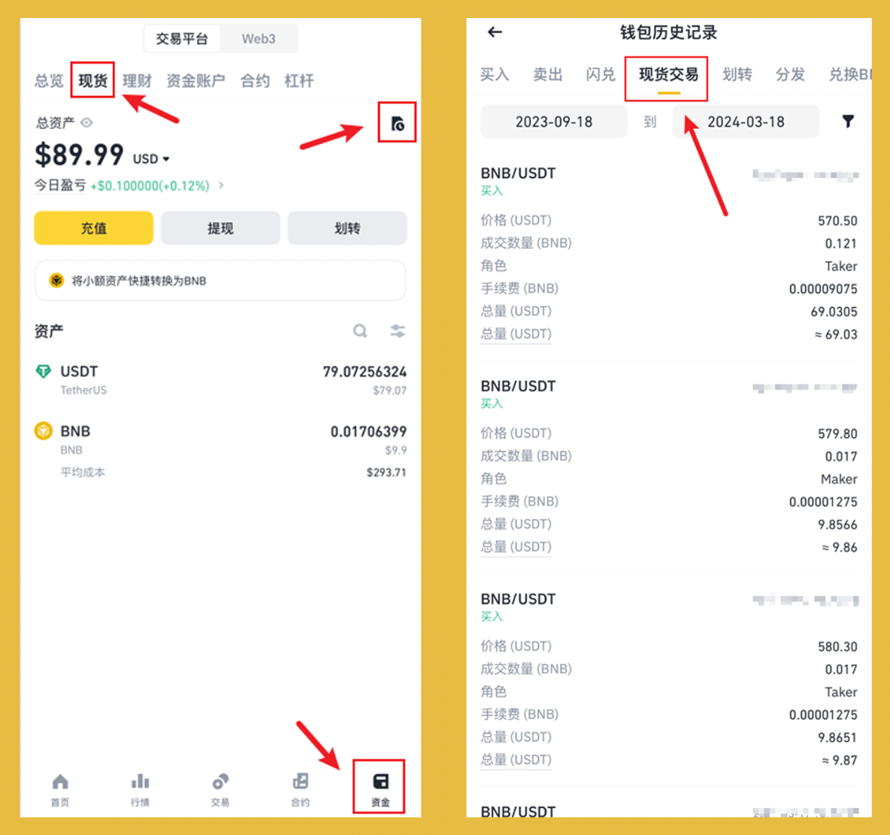

交易是必须学会的，无论你是二级玩家还是链上玩家。你总需要买入目标代币，等待回报或缴纳链上手续费(Gas)。

交易才是投资第一步，选定目标币种，买入等起飞！是交易所中一个非常基础又非常重要的功能！

本篇以宇宙第一大所 #币安 为例，以图文线程的方式，用详细的教程，教会小白最基础交易！

## **0/ 前置：注册 + 充值**

>未注册的可使用哈皮的返佣链接注册，节约 20% 的手续费，不要小看手续费，币安现货手续费是 0.1%，1000 块钱买入卖出，收 2 块钱手续费！

👉 注册链接：[https://www.binance.com/zh-CN/join?ref=VA0OUR3W](https://www.binance.com/zh-CN/join?ref=VA0OUR3W)

👉 教程链接：[注册 + 充值](https://bithappy.xyz/posts/how-to-deposit-fiat-currency-to-binance/)

## **1/  查找目标虚拟币：**

以 $BNB 为例，交易对选择 BNB/USDT。$USDT 为最常用的与美元绑定价格的稳定币，入金时也推荐 USDT ！

打开 `App` -> 点击 `首页`  -> 点击上方 `搜索框`  -> 输入 `BNB`  -> 点击现货中 `BNB/USDT`  

## **2/ 选择交易类型：**

点击 `买入`  -> 点击 `限价单`

交易常用两种交易类型，限价单与市价单。

限价单：使用指定价格的进行交易订单，当目标代币到达指定价格，才会进行成交，常用于`等待币价下跌`时使用。

市价单：使用当前价格的进行交易订单，一般在`比较急`或者`不在乎当时币价`时使用！

## **3-1/ 提交订单(限价单)：**

点击 `价格框` 输入价格 -> 点击 `数量` 或 `成交金额` 输入购买的代币数量或金额  -> 点击 `买入`

此时，除非价格立马到达指定价格，否则下方会出现最新的一笔订单，当订单消失时代表交易完成。

## **3-2/ 提交订单(市价单)：**

点击 `价格框` 输入价格 -> 点击 `成交金额` 输入金额  -> 点击 `买入`

当点击买入时，交易就已经完成！

## **4/ 查看资产与历史订单：**

查看资产：点击 `资金` -> 点击 `现货` -> 如果订单成交，那么已经能看到资产变化

历史订单：点击 `右上角` 历史图标 -> 点击 `现货交易` -> 可查看指定日期内的历史订单

至此交易完成。

## **5/ 自由探索：**

关注[@BitHappyX](https://x.com/intent/follow?screen_name=BitHappyX)，见证成长，一起暴富！

如果内容对你有帮助，还请一键三连，谢谢！！！
