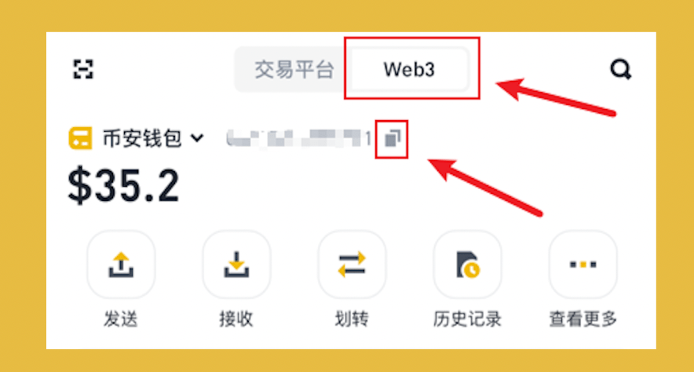
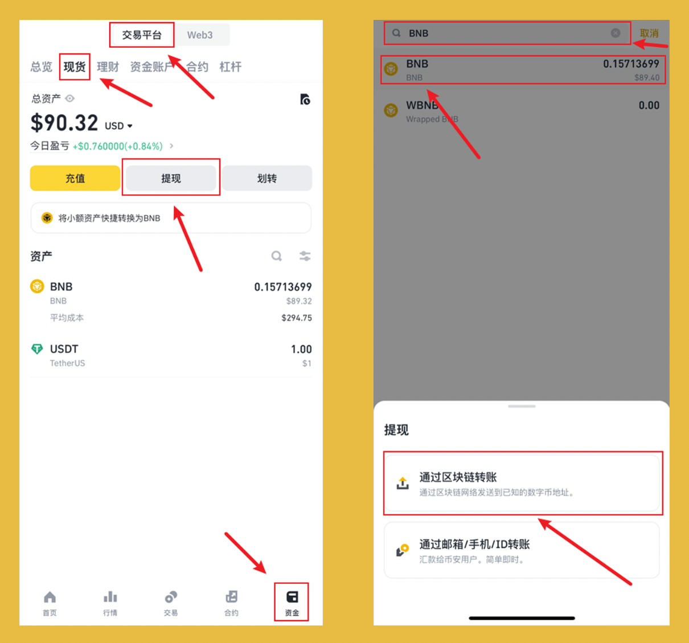
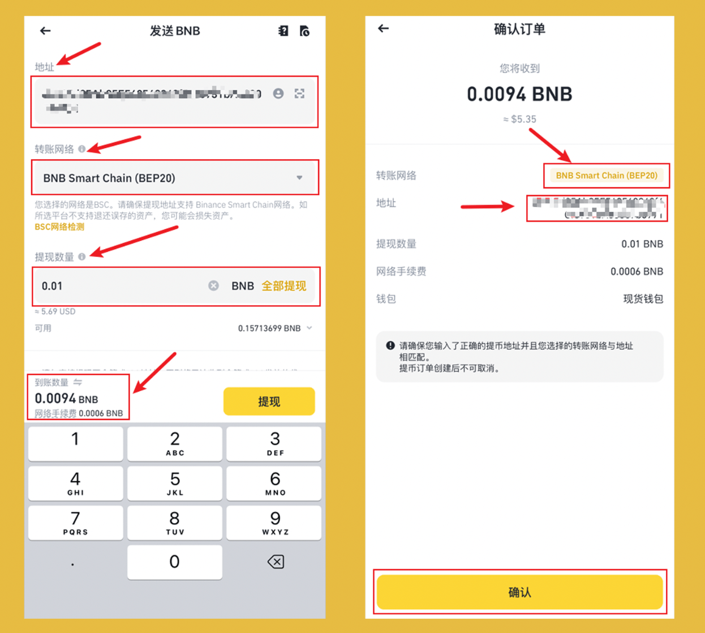
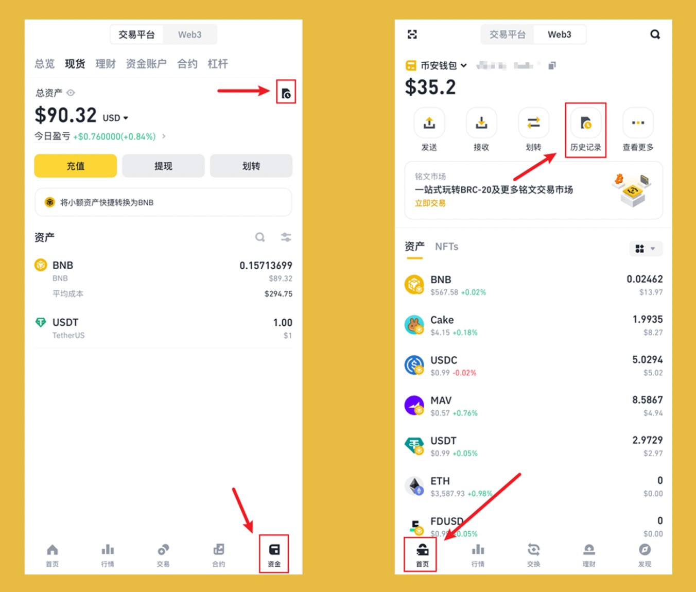

提现到链上是畅游加密世界的必经之路！完成这一步，才算是真正的拥有加密货币！

在区块链的世界中，不同的网络(链)需要不同的加密货币作为手续费(Gas)，币安官方生态最为知名为 BSC 网络，$BNB 是该网络的手续费！

本篇以宇宙第一大所 #币安 为例，以图文线程的方式，用详细的教程，教大家如何拥有加密资产！

## **0/ 前置：注册 + 充值 + 交易 + 创建 Web3 钱包**

>未注册的可使用哈皮的返佣链接注册，节约 20% 的手续费，不要小看手续费，币安现货手续费是 0.1%，1000 块钱买入卖出，收 2 块钱手续费！

👉 注册链接：[https://www.binance.com/zh-CN/join?ref=VA0OUR3W](https://www.binance.com/zh-CN/join?ref=VA0OUR3W)

👉 教程链接：[注册 + 充值 + 交易 + 创建 Web3 钱包](https://bithappy.xyz/posts/how-to-create-a-binance-web3-wallet/)

## **1/ 获取钱包地址：**

打开 `App` -> 点击 `Web3` -> 点击 `首页` -> 点击 `复制` 图标

此处复制的地址是 EVM (以太坊虚拟机)的网络，BSC网络是以太坊的衍生，地址与以太坊地址相同。

## **2/ 选择提现代币($BNB)：**

点击 `交易平台` -> 点击 `资金` -> 点击 `现货` -> 点击 `提现` -> 在 `搜索框` 输入 BNB -> 选择 `BNB` -> 点击 `通过区块链转账`

## **3/ 提现：**

粘贴此前复制钱包地址到 `地址` 中 -> 选择 `转账网络 为 BNB Smart Chain (BEP20)` ->输入 `提现数量` -> 点击 `提现` -> 点击 `确认`

到账数量：会扣除提现到链上的手续费。
确认订单：一定要检查地址是否正确，一旦错误，转出后便无法找回！网络部分同样如此，但是由于与以太坊兼容的网络非常多，所以如果是以太坊兼容网络，一般问题不大。

## **4/ 查询提现记录：**

提现属于链上交易，由于区块链的特性，需要一段时间的等待，可打开提现记录，查询提现情况。

交易所查询： 点击 `交易平台` -> 点击 `资金` -> 点击右上方 `历史图标` -> 点击 `提现`  -> 点击 `数字币地址转账`

Web3钱包查询：点击 `Web3` -> 点击 `首页` -> 点击 `历史记录`

## **5/ 自由探索：**

关注[@BitHappyX](https://x.com/intent/follow?screen_name=BitHappyX)，见证成长，一起暴富！

如果内容对你有帮助，还请一键三连，谢谢！！！
